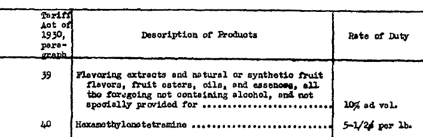
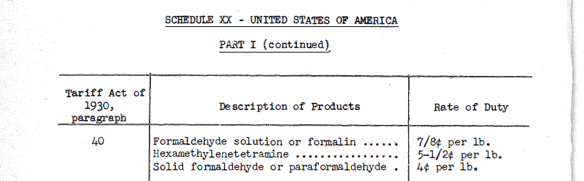
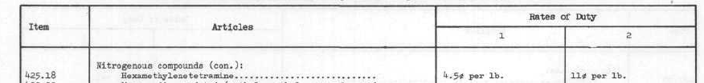

```{r, include=FALSE}
knitr::opts_chunk$set(echo = TRUE)
```

## Data sources

| File name | Content | Sources|
|:---|:---|:---|
| Geneva47_UNTC| Individual round schedules of Geneva 1947|UNTC official website, Registration number A-814, Volume number 61. ^[<https://treaties.un.org/doc/Publication/UNTS/Volume%2061/v61.pdf>]|
| Annecy_UNTC| Individual round schedules of Annecy 1949|UNTC official website, Registration number A-814, Volume number 63. ^[<https://treaties.un.org/doc/Publication/UNTS/Volume%2063/v63.pdf>]|
| Torquay_UNTC| Individual round schedules of Torquay 1951|UNTC official website, Registration number A-814, Volume number 144. ^[<https://treaties.un.org/doc/Publication/UNTS/Volume%20144/v144.pdf>]|
| Geneva56_UNTC| Individual round schedules of Geneva 1956|UNTC official website, Registration number A-814, Volume number 245. ^[<https://treaties.un.org/doc/Publication/UNTS/Volume%20245/v245.pdf>]|
| Dillon_UNTC| Individual round schedules of Dillon 1960|UNTC official website, Registration number A-814, Volume number 440. ^[<https://treaties.un.org/doc/Publication/UNTS/Volume%20440/v440.pdf>]|
| Kennedy_UNTC| Individual round schedules of Kennedy 1964|UNTC official website, Registration number A-814, Volume number 624. ^[<https://treaties.un.org/doc/Publication/UNTS/Volume%20624/v624.pdf>]|
| Tokyo_UNTC| Individual round schdules of Tokyo 1979|UNTC official website, Registration number A-814, Volume number 1189. ^[<https://treaties.un.org/doc/Publication/UNTS/Volume%201189/v1189.pdf>]|
|Uruguay_UNTC_1|Individual round schedules of Uruguay 1988, till chapter 63|UNTC official website, Registration number A-814, Volume number 1632. ^[<https://treaties.un.org/doc/Publication/UNTS/Volume%201632/v1632.pdf>] |
|Uruguay_UNTC_2|Individual round schedules of Uruguay 1988, rest of the chapters|UNTC official website, Registration number A-814, Volume number 1634. ^[<https://treaties.un.org/doc/Publication/UNTS/Volume%201634/v1634.pdf>]|
| Torquay (black white)|Consolidated version of rounds: Geneva47, Annecy and Torquay|The hard copy was borrowed from the Library of University of Texas.<br> We then scanned and digitized the copy. ^[<https://search.lib.utexas.edu/discovery/fulldisplay?context=L&vid=01UTAU_INST:SEARCH&search_scope=MyInst_and_CI&tab=Everything&docid=alma991056424989706011>]|
|Tariff Act of 1930 cleaner|Initial tariff schedule of 1930 Smoot-Hawley Tariff Act|Citation information:<br> volume: 46 <br> page: 590<br> npages: 175<br> file: STATUTE-46-Pg590.pdf<br> congress: 71<br> type: publaw<br> number: 361<br> citation: Pub. Law 71-361<br> topic: Tariff Act of 1930<br> title: AN ACT To provide revenue, to regulate commerce with foreign countries, to<br> encourage the industries of the United States, to protect American labor, and<br> for other purposes. June 17, 1930 590<br> Link for the file ^[<https://govtrackus.s3.amazonaws.com/legislink/pdf/stat/46/STATUTE-46-Pg590.pdf>]; <br>link for citation information: ^[<https://github.com/unitedstates/legisworks-historical-statutes/blob/master/data/046.yaml>]|
|US pre-GATT tariff schedule|United States Import Duties, June 1946.|University of Minnesota, Hathitrust Online Library: ^[<https://catalog.hathitrust.org/Record/100721221?type%5B%5D=all&lookfor%5B%5D=united%20states%20import%20duties%20june&ft=>] <br>Citation information:<br> United States Tariff Commission. (1946). United States import duties, June 1946. Washington: U.S. Govt. Print. Off.
|Tariff Classification Study volume 9|Cross reference schedule between TSUSA system and Smoot-Hawley system in 1962|The Ohio State University, Hathitrust Online Library: ^[<https://catalog.hathitrust.org/Record/102256592>] <br> Citation information:<br>United States Tariff Commission. (196061). Tariff classification study. Washington: U.S. Govt. Print. Off..|
|US 1962 Tariff Act|The first TSUSA tariff schedule system that bridged Dillon round and Kennedy round|The document can be found in various sources, the one we used for digitization is uploaded by University of Illinois at Urbana-Champaign, on Hathitrust Online Library ^[<https://babel.hathitrust.org/cgi/pt?id=uiug.30112105143967&view=1up&seq=3>]|


\newpage

## Examples

Here we share images of our source files for an illustrative example. The product displayed is the pharmaceutical chemical *Hexamethylenetetramine*. Under the Smoot Hawley enumeration, it is assigned paragraph number 40, as shown in both the Geneva 1947 tariff schedule and the consolidated file from Torquay. Under the TSUSA system, it is assigned code 425.73.

As the figures below illustrate, the schedules usually consist of three parts: the item number (Smoot Hawley paragraph number or TSUSA code), the product description, and the rate of duty. We structure our data to follow this framework.







\newpage

## Details of the Digitization Process{#digdetails}

### The Smoot-Hawley System

We refer to the first document we found---a tariff schedule for the United States that consolidates the concessions in the Geneva, Annecy and Torquay rounds---as "Torquay (black white)." This document was in hard copy, borrowed from the University of Texas Libraries. We scanned the hard copy, conducted optical character recognition (OCR) and digitized the file in R. By running the R package *pdftools*,^[<https://cran.r-project.org/web/packages/pdftools/pdftools.pdf>] we obtain an editable Microsoft Excel file that consists of detailed product descriptions and their corresponding tariff rates. Since "Torquay (black white)" contains the schedules of the first three rounds, we were able to construct a benchmark schedule that includes most of the products from Smoot-Hawley through the Dillon Round.

Subsequently, we found more complete and systematic data in the United Nations Treaty Collection (UNTC). Here there are schedules for each round individually. For these we manually entered the United States tariff rate for each round line by line based on the framework we had constructed via "Torquay (black white)." To check the reliability of our benchmark file, we compared the three individual rounds we have from the UNTC (i.e., "Geneva47_UNTC," "Annecy_UNTC" and "Torquay_UNTC") with the consolidated version "Torquay (black white)" and found no differences in tariff rates. 

Next, we located the original 1930 Tariff Act document ("Tariff Act of 1930 cleaner") and entered its tariff rates in order to identify the Smoot-Hawley tariffs as a benchmark. The Smoot-Hawley tariffs make sense as a benchmark because they continued to be the prevailing legal tariffs of the U.S. unless modified by subsequent agreement or legislation. We therefore made sure to enter all products in the original Smoot-Hawley into our database. That is, even if some products did not show up in later rounds, they are still included for completeness. 

To pin down more precisely the magnitude of the tariff reductions of the first round of GATT negotiations (Geneva 1947), we also digitized the US tariff schedule of the year 1946, using the file "United State Import Duties June 1946." The file contains all tariff changes between 1930 and 1946, both unilaterally and through bilateral negotiations.

With the information above, we are able to identify the magnitude of tariff reductions of every GATT round that uses the Smoot-Hawley tariff system. 

After manually cleaning the data in Excel, we save the file as a comma separated values file (csv) in the UTF-8 format and import into R for further data clean, standardizing units for specific tariffs and analysis.

### TSUS system

The TSUS system was first utilized in GATT negotiations in the Kennedy round (1964). To incorporate this new system, we started a separate file for the TSUSA tariffs by digitizing the schedule in the Tariff Act of 1962.^[This act formally changed the tariff system and became effective on August 31, 1963.]

The Tariff Act of 1962 is not related to GATT negotiations. Rather, we digitized it because it provides a comprehensive framework for the TSUS system and helps to fill the gap between the last round under the Smoot-Hawley system (Dillon) and the first round under the TSUS system (Kennedy). Everything we've learned so far indicates that the schedule associated with the Tariff Act 1962 represents the US tariff level after the Dillon round but organized under TSUSA system.^[Two main facts support our belief: (1) we observe that the tariff rates for similar products are exactly the same in the Tariff Act 1962 and the second stage of the Dillon round; (2) the time span between the effective dates of two documents is short: the second stage of Dillon round was effective in 1962 and the Tariff Act of 1962 was effective on August 31, 1963. We will be able to say something more definitive once we have completed the concordance between the Smoot-Hawley and TSUS systems.] 

Here we used an approach similar to the one described in the previous subsection. We began with the document "Tariff Act 1962" from United States International Trade Commission.^[Several pages are missing in this document, so we also used files from the Hathitrust Digital Library to complete the schedule.] We applied the same optical character recognition tools and constructed the framework of the tariff schedule system in Excel. We then used the tariff schedule files of the Kennedy and Tokyo rounds collected from the UNTC website to manually enter the tariff rate data for each product, line by line. In the Tokyo round, some tariff codes from 1962 and the Kennedy Round are replaced by the introduction of new codes, so we also created an "exit and entry" column in our dataset to record these changes. Finally, we followed the same data cleaning and unit-normalization process as in the previous section.


## Industrial Classification Systems

### Smoot-Hawley: Schedule

| Schedule | Category                                         | Smoot-Hawley Paragraph |
|----------|--------------------------------------------------|------------------------|
| 1        | Chemicals, Oils, and Paints                      | 1 to 97                             |
| 2        | Earths, Earthenware, and Glassware               | 201 to 236                          |
| 3        | Metals and Manufactures of                       | 301 to 398                          |
| 4        | Wood and Manufactures of                         | 401 to 412                          |
| 5        | Sugar, Molasses, and Manufactures of             | 501 to 506                          |
| 6        | Tobacco and Manufactures of                      | 601 to 605                          |
| 7        | Agricultural Products and Provisions             | 701 to 783                          |
| 8        | Spirits, Wines, and Other Beverages              | 801 to 815                          |
| 9        | Cotton Manufactures                              | 901 to 924                          |
| 10       | Flax, Hemp, Jute, and Manufactures of            | 1001 to 1022                        |
| 11       | Wool and Manufactures of                         | 1101 to 1122                        |
| 12       | Silk Manufactures                                | 1201 to 1211                        |
| 13       | Manufactures of Rayon or Other Synthetic Textile | 1301 to 1313                        |
| 14       | Papers and Books                                 | 1401 to 1413                        |
| 15       | Sundries                                         | 1501 to 1559                        |
| 16       | Title II - Free List                             | 1601 to 1814                        |

### TSUSA: Section

+---------+--------------------------------------------------------------+-------------------+
| Section | Category                                                     | TSUSA Code        |
+=========+==============================================================+===================+
| 1       | Animal and Vegetable Products                                | 100.01 to 193.25  |
+---------+--------------------------------------------------------------+-------------------+
| 2       | Wood and Paper; Printed Matter                               | 200.03 to 274.90  |
+---------+--------------------------------------------------------------+-------------------+
| 3       | Textile Fibers and Textile Products                          | 300.10 to 390.60  |
+---------+--------------------------------------------------------------+-------------------+
| 4       | Chemicals and Related Products                               | 401.02 to 495.20  |
+---------+--------------------------------------------------------------+-------------------+
| 5       | Nonmetallic Minerals and Products                            | 511.11 to 548.05  |
+---------+--------------------------------------------------------------+-------------------+
| 6       | Metals and Metal Products                                    | 601.03 to 696.60  |
+---------+--------------------------------------------------------------+-------------------+
| 7       | Specified Products: Miscellaneous and Nonemunerated Products | 700.05 to 799.00  |
+---------+--------------------------------------------------------------+-------------------+
| 8       | Special Classification Provisions                            | 800 to 870.25     |
+---------+--------------------------------------------------------------+-------------------+

## Free lists

Under the Smoot Hawley classification system, items that were free of duty were gathered together into Schedule 16 instead of being integrated into a schedule with like products. That is, the products in Schedule 16 all are free of duty, and unlike the products in Schedules 1-15, the free list products come from many industries. For now, we have not included Schedule 16 in the main data. 

Products free-of-duty were organized differently under the TSUSA system. Using both keyword searches and the cross-reference table in Volume 9 of the 1962 Tariff Classification Study, it appears that almost all of the free-of-duty item from Smoot-Hawley are included in the section of TSUSA that corresponds to the industrial characteristics of the product. We will thus integrate the free-of-duty products once we have finished the concordances to the TSUSA Harmonized System classification systems.

Interestingly, the products in the free-of-duty Schedule 16 under the Smoot Hawley classification system entered the tariff schedule gradually. To be more specific, in each round only some of the free-of-duty products from the Tariff Act of 1930 (Smoot Hawley) are included in the tariff schedule.

Between 1930 and when a product enters one of the GATT schedules, the status is not entirely clear. We have not found conclusive evidence to resolve this issue. Given that the Smoot Hawley Act unilaterally set tariff policy free of international commitments, our educated guess is that the U.S. authorities could increase the duty on these products unilaterally. What is clear is that once these products enter a GATT schedule, the U.S. was committed to not subsequently charge a duty on these products. We thus infer that if a product was  free of duty in the Tariff Act of 1930 but not included in the free list in the GATT negotiated schedules, the US government either wanted to have more flexibility on this product or had not yet found a negotiating partner who was willing to exchange commitments involving the product.


## Tariff intervals{#int}

When, in addition to the usual ad valorem or specific tariff, a line also has a minimum or maximum tariff, we classify the line as being of the"tariff interval" type. For example Paragraph 210 *Rockingham earthenware* in the Geneva 1947 schedule has its rate description as *"20 cents per doz. articles, but not less 7.5% nor more than 25%."*

To incorporate this type of tariff formula, we followed the approach used in the consolidated Torquay schedule and the TSUSA system, that is to divide the single line for that product into multiple lines according to the values of the minimums and maximums. In the consolidated Torquay schedule, *Rockingham earthenware* is listed as three separate lines: *"Rockingham earthenware, valued per dozen articles: under 80 cents - 25% ad valorem"*, *"Rockingham earthenware, valued per dozen articles: over 80 cents and under 266.67 cents - 20 cents per doz, articles"* and *"Rockingham earthenware, valued per dozen articles: over 266.67 cents - 7.5% ad valorem"*. Notice that the threshold value for each line is calculated based on the minimum and maximum of tariff rate. With this method, we manually transformed all the tariff interval type lines into separate lines based on their values.

One thing to note is that, as the tariff rates were reduced across rounds, some of the threshold values may also change. Usually these changes are trivial and adding more lines for each newly-calculated threshold would induce more distortion to the data than using the original thresholds. Therefore we use the original threshold value unless the tariff interval formula itself changed over time. We created an "Intervals" dummy variable to keep track of lines that are affected by the tariff interval issue.

## Line splitting{#split}

Another frequent issue in aligning the tariff schedules through time is what we call line splitting. The original product descriptions in the Tariff Act of 1930 paragraphs are often quite general and sometimes ambiguous and we find that the descriptions are often split in later schedules to create product lines whose descriptions are narrower. This seems to happen when the negotiators wanted to apply two different tariffs to what was formerly a single line.

An example of this is Paragraph 24, which is described in the Tariff Act of 1930 as *"Flavoring extracts, and natural or synthetic fruit flavors, fruit esters, oils, and essences, all the foregoing and their combinations."* In the Dillon round tariff schedule, the paragraph is divided into *"Flavoring extracts, and natural or synthetic fruit flavors, fruit esters, oils, and essences, all the foregoing and their combinations: unfit for beverage purposes, containing of alcohol ..."* and *"Flavoring extracts, and natural or synthetic fruit flavors, fruit esters, oils, and essences, all the foregoing and their combinations: fit for beverage purposes, containing of alcohol ..."*.

More restrictions on the descriptions or new types of delineation were introduced as the tariff system evolved. To deal with these splitting lines, we create new lines for each split and enter a uniform tariff rate in earlier schedules for any line that was previously included in the more general (un-split) line. In this way we keep the completeness of the schedule and avoid losing information on differentiated products.

## Staging{#staging}

Beginning in the Geneva 1956 round, the tariff reductions were made in multiple stages. In the source documents for Geneva 1956 and Dillon, there is a column for each stage.^[Geneva 1956 has three stages while Dillon has two stages.] Typically there is one year between implementation of each stage. Although most products that are negotiated in each round have different tariffs in each stage, some products do have the tariff rate for more than one stage. To deal with staging, we created separate columns for these stages and track the tariff reduction across stages. However, when comparing the tariff reduction across rounds, we focus on the tariff rate in the final stage.


## GATT contracting parties

\textcolor{red}{TO BE ADDED WHEN READY}
